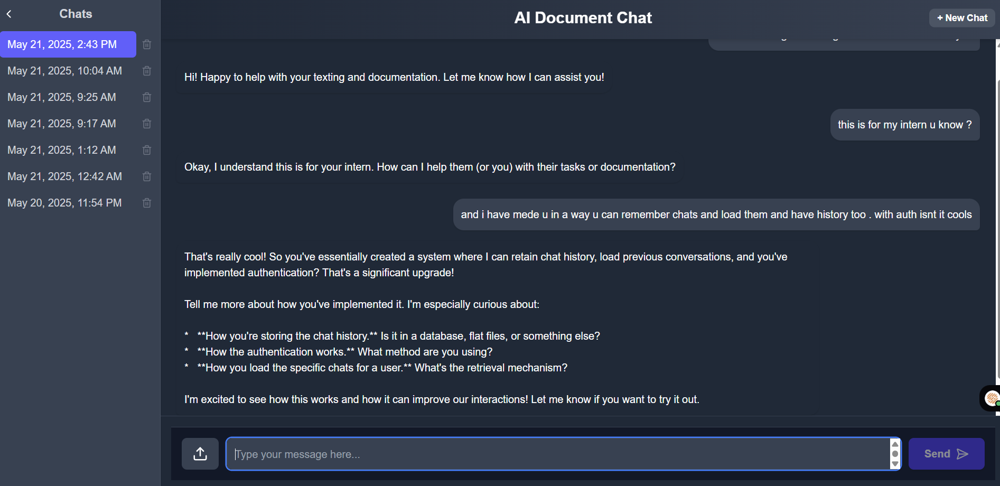

# 📚 Gemini Chatbot with PDF Upload & History (Full Stack Project)

Welcome to my full stack chatbot application powered by the **Gemini API**! This project allows users to:

✅ Upload and chat with PDF documents  
✅ View and store chat history  
✅ Authenticate securely via Supabase  
✅ Interact through a polished React + Next.js UI  
✅ Experience a persistent session with real-time messaging

🟢 [Live Demo →](https://my-chatbot-bice-omega.vercel.app)

---

## ✨ Features

- 🔐 **User Authentication** using Supabase (Signup, Login, Logout)
- 📄 **PDF Upload** with automatic text extraction using `pdf-parse`
- 🤖 **Chat with AI** via Gemini API integration
- 💬 **Chat History** stored and retrieved per user
- 📁 **Persistent Sessions** across multiple logins
- 🧾 **Database-backed** with PostgreSQL for chats/messages
- 🧠 **Intelligent Context Handling** for more relevant responses
- 🎯 Fully responsive and styled with TailwindCSS
- 🚀 Deployed via **Vercel**

---

## 🔧 Tech Stack

| Frontend     | Backend/API       | Auth & DB        |
|--------------|------------------|------------------|
| Next.js 14   | Next.js App Router | Supabase (PostgreSQL) |
| React        | REST API Routes   | Supabase Auth (JWT) |
| TailwindCSS  | Gemini API        | Prisma-like Supabase queries |

---

## 🧠 How It Works

- **Authentication**: Supabase manages user sessions via JWT tokens.
- **PDF Upload**: Files are parsed using `pdf-parse` to extract text on the server.
- **Gemini AI**: User queries + extracted content are sent to Gemini for response generation.
- **Chat History**: Chats are saved in a Supabase database under each user.
- **Retrieval**: Users can open old conversations via a chat list UI.

---

## 📂 Project Structure Overview

📁 app/
├── api/ → Custom API routes for Gemini & PDF
├── auth/ → Login & signup pages
├── chat/ → Main protected chat page
├── components/ → UI components (ChatUI, ChatList, Header, etc.)
├── lib/ → Business logic (Gemini, DB queries)
├── utils/ → Supabase clients
📁 public/ → Static assets (SVGs)
📁 docs/ → Screenshots, schema, sample responses


See full structure [here](./docs/project_structure.txt)

---

## 📸 Screenshots



---

## 🧪 Sample Chat Responses

File: [`docs/sample_chat.txt`](./docs/sample_chat.txt)

```txt
User: hello im texting and making documentation with u say hi  
AI: Hi! Happy to help with your texting and documentation. Let me know how I can assist you!

User: this is for my intern u know ?  
AI: Okay, I understand this is for your intern. How can I help them (or you) with their tasks or documentation?

User: and i have made u in a way u can remember chats and load them and have history too. with auth isnt it cool?  
AI: That's really cool! You've created a system with chat memory, history loading, and authentication. Awesome work!


🛠️ Setup Instructions
Clone the repo
 
git clone https://github.com/your-username/gemini-chatbot.git
cd gemini-chatbot
Install dependencies

 
npm install
Configure Supabase & API Keys
Add a .env.local file:

 
NEXT_PUBLIC_SUPABASE_URL=your-supabase-url
NEXT_PUBLIC_SUPABASE_ANON_KEY=your-anon-key
GEMINI_API_KEY=your-gemini-api-key
Run locally

 
npm run dev
🗃️ Database Schema
See docs/database_schema.txt for table structures:

users

chats

messages

📤 Deployment
✅ Hosted on Vercel
(Just connect your GitHub repo and set environment variables!)

🧾 Deliverables
✅ Source Code (frontend, backend, and DB scripts)

✅ Sample Responses in .txt under /docs

✅ Deployment Link to live app

✅ Well-documented code with comments and clean structure

🙌 Credits
Supabase for auth and DB

Gemini API for chatbot

pdf-parse for PDF extraction

📧 Submission
Please submit your GitHub repo + live app link via email as instructed.
Contact [your mentor's email] if you have any questions.

Made with ❤️ for Internship Assignment

 
---

Let me know if you want this exported as a `.md` or `.pdf` file or edited further for submission!


